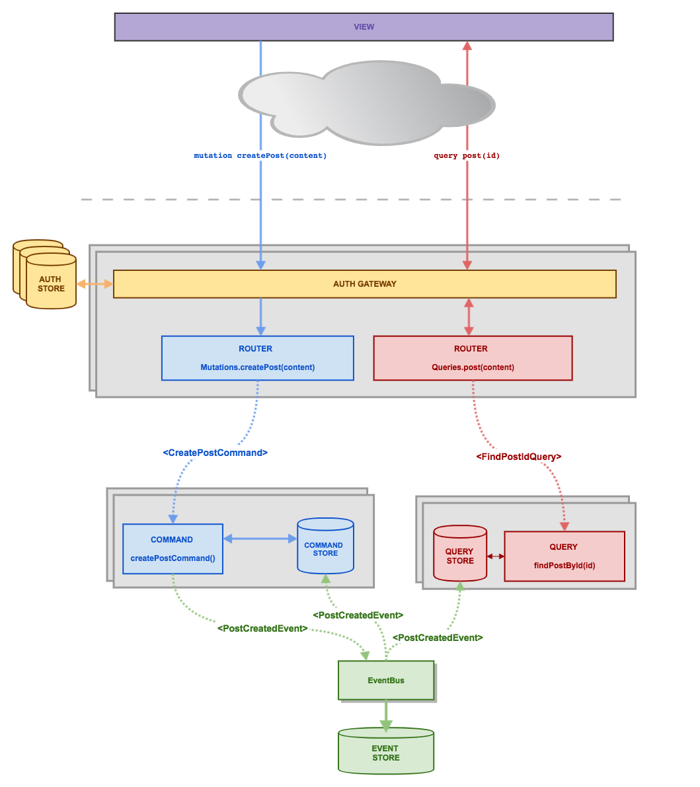

# Microlithic Application

A microlithic application is deployed as a monolith but conceptually functions like a microservice system.

The way we do this is by sending messages between select component boundaries using events.

When ready to scale up we can replace the event busses with ones that proxy scalable services such as Kafka or RabbitMQ.

### Patterns

Conceptually we use two patterns that work well with each other, EventSourcing and CQRS.

Here is a high level overview:



EventSourcing means considering the state of your application as an immutable series of events.

CQRS basically means separating your query system from your command system.

The advantages of doing this in a microservices architecture is that you can scale your reads at a different rate to your writes and it ensures that so long as you are happy with eventual consistency your app should be able to take a huge amount of traffic.

### Example of sending synchronous messages

Some might ask well how do you send a synchronous message such as a query for state using a system like this?

Here is an example from our routes file here. In this example we want to get the current user email information. To do this we need to send a `CurrentUserRequest` message across the query event bus. Listening for that message is a service that will send a `CurrentUserResponse` message back.

```typescript
// Create the event
const event = correlatedEvent(
  CurrentUserRequest({
    id: 123
  })
);

// Dispatch it
QueryBus.dispatch(event);

// Wait for the response with a 10 second timeout
const response = await QueryBus.waitForEvent<CurrentUserResponse>(
  event.correlationId,
  'CurrentUserResponse',
  10000
);

console.log(reponse); // {email:"foo@bar.com"}
```

### Sending an Asynchronous Message
Naturally you don't need to wait for a response and can simply shoot off a command and continue processing or provide some kind of optimistic response to the user.

```typescript
CommandBus.dispatch(
  LogoutCommand({
    sid
  })
);
```

### Multiple Busses
You can also wait for events off different buses:

```typescript
const event = correlatedEvent(
  LoginCommand({
    email,
    password,
    sid
  })
);

CommandBus.dispatch(event);

await EventBus.waitForEvent<UserLoggedInEvent>(
  event.correlationId,
  'UserLoggedInEvent'
);
```

### Waiting for Multiple Events
You can wait for the first correlated error event from a selection of events:

```typescript
const event = correlatedEvent(
  LoginCommand({
    email:"foo@bar.com",
    password: "fa352471287",
    sid: "12345687651234"
  })
);

// Dispatch it
CommandBus.dispatch(event);

// This will wait for the first correlated resultant event
const answer = await EventBus.waitForEvent<UserLoggedInEvent,LoginErrorRaised>(
  event.correlationId, 
  [
    'UserLoggedInEvent', 
    'LoginErrorRaised'
  ]
);
```

### Listening for messages

Basically to subscribe to events you simply call the subscribe method on the event bus:

```typescript
CommandBus.subscribe('MyCommandEvent', myCommandFunction);
```

A full command function example might look like this:

```typescript
async function registerCommand ({
  email,
  password:hashedPassword,
  role,
  correlationId
}: RegisterCommand) {

  // Go save this user and their data
  dispatch(
    UserRegisteredEvent({
      correlationId,
      email,
      password: hashedPassword,
      role
    })
  );
};

CommandBus.subscribe('RegisterCommand', registerCommand);
```


