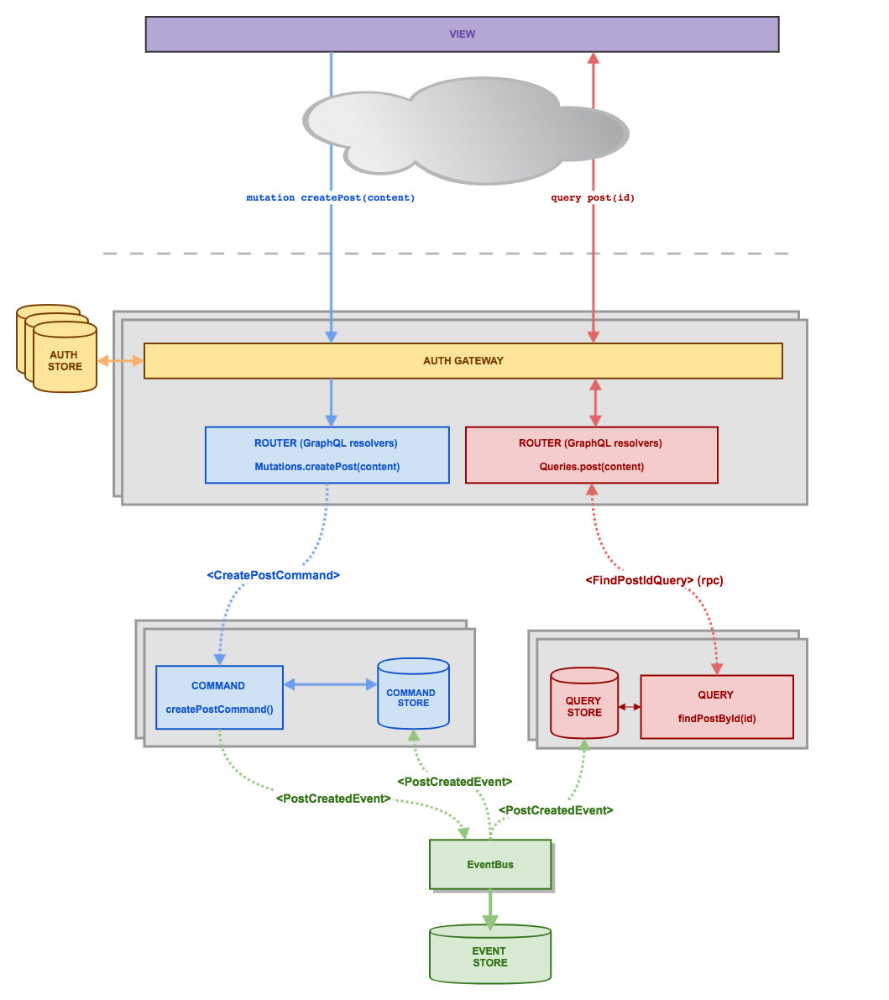

# Microlithic Application

A microlithic application is deployed as a monolith but conceptually functions like a microservice system.

The way we do this is by sending messages between select component boundaries using events.

When ready to scale up we can replace the event busses with ones that proxy scalable services such as Kafka or RabbitMQ.

### Patterns

Conceptually we use two patterns that work well with each other, EventSourcing and CQRS.

Here is a high level overview:

EventSourcing means considering the state of your application as an immutable series of events.

CQRS basically means separating your query system from your command system.

The advantages of doing this in a microservices architecture is that you can scale your reads at a different rate to your writes and it ensures that so long as you are happy with eventual consistency your app should be able to take a huge amount of traffic.
